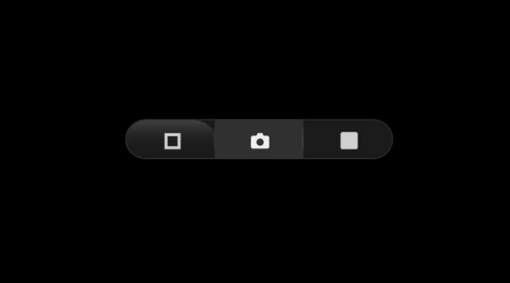

<p align="center">
  <picture>
    <source media="(prefers-color-scheme: dark)" srcset="assets/branding/logo-white.svg">
    
  </picture>
</p>

<h1 align="center">OpenSnap</h1>

<p align="center">
  <strong>A floating screenshot widget for Windows — one click, saved and copied.</strong>
</p>

<p align="center">
  
  <a href="https://apps.microsoft.com/detail/9NV4G1F09L41">
    
  </a>
  <a href="https://github.com/sparshsam/opensnap/releases/latest">
    
  </a>
  <a href="https://github.com/sparshsam/opensnap">
    
  </a>
</p>

<br>

<p align="center">
  
</p>

<br>

---

<br>

## Why OpenSnap

Every screenshot tool is either bloated, buried in menus, or requires three clicks before you get an image. OpenSnap lives on your screen as a translucent glass capsule — click to capture, drag to move. That's it.

<br>

## Features

<table>
  <tr>
    <td width="50%">
      <h3>📷 One-click capture</h3>
      <p>Full multi-monitor desktop, active window, or drag-select an area. All from the same floating pill.</p>
    </td>
    <td width="50%">
      <h3>📝 OCR built in</h3>
      <p>Extract text from any screen region using Windows OCR. Copied to clipboard alongside the image.</p>
    </td>
  </tr>
  <tr>
    <td width="50%">
      <h3>🎯 Three-button pill</h3>
      <p>Area selection (toggle), full screen, active window — each with its own tactile bounce animation.</p>
    </td>
    <td width="50%">
      <h3>⌨️ Global hotkeys</h3>
      <p>Win+Shift+S for full screen, Win+Shift+W for active window. Customisable in Settings.</p>
    </td>
  </tr>
  <tr>
    <td width="50%">
      <h3>📂 Screenshot history</h3>
      <p>Last 20 captures in the tray menu. Pin, delete, or clear individual entries.</p>
    </td>
    <td width="50%">
      <h3>🎨 Quick actions</h3>
      <p>After capture: copy, OCR, open in Paint, reveal in Explorer, or open with your preferred editor.</p>
    </td>
  </tr>
  <tr>
    <td width="50%">
      <h3>🔤 Smart naming</h3>
      <p>Custom filename templates with project prefixes, sequential numbering, and date-based subfolders.</p>
    </td>
    <td width="50%">
      <h3>🌐 5 languages</h3>
      <p>English, French, German, Spanish, Japanese. Switch anytime in Settings.</p>
    </td>
  </tr>
</table>

<br>

---

<br>

## ⭐ Get OpenSnap

| Method | Notes |
|---|---|
| **[Microsoft Store](https://apps.microsoft.com/detail/9NV4G1F09L41)** (Recommended) | Seamless automatic updates through Microsoft Store. Signed, trusted, one-click install. |
| [Download MSIX](https://github.com/sparshsam/opensnap/releases/latest) (Unsigned) | Standalone `.msix` package. Intended for manual sideloading or testing. Not code-signed — see [Troubleshooting](docs/Troubleshooting.md). |
| [Download EXE Installer](https://github.com/sparshsam/opensnap/releases/latest) | Inno Setup installer. Per-user or per-machine install, silent install support. |
| [GitHub Source Code](https://github.com/sparshsam/opensnap) | Build from source. Requires .NET 8 SDK and Windows 10/11. |

<br>

## Designed For

People who take screenshots dozens of times a day — developers, designers, support agents, writers, and anyone who values speed over menu hunting.

No login, no cloud, no telemetry. It saves to your Desktop and gets out of your way.

<br>

## Design Philosophy

> *"A screenshot tool shouldn't feel like an application. It should feel like part of the screen."*

Translucent glass, minimal footprint (240 × 36 px), always-on-top, and zero chrome. The widget is intentionally not an app window — it's a utility that sits at the edge of your workflow.

<br>

## Built With

<p align="left">
  
  
  
  
</p>

<br>

## Version Journey

```
v0.1  ·  Initial glass capsule, basic capture        28 Jun 2026
v0.5  ·  OCR, rename to OpenSnap                     28 Jun 2026
v0.6  ·  Installer, About dialog, settings fixes     29 Jun 2026
v0.7  ·  Triple-button pill, bounce, green flash     29 Jun 2026
v0.8  ·  Quick actions, naming, history pinning      29 Jun 2026
v0.9  ·  Languages, accessibility, auto-update       29 Jun 2026
v1.0  ·  Stable release — polished, documented       30 Jun 2026
```

Full changelog → [CHANGELOG.md](CHANGELOG.md)

<br>

## License

[MIT](LICENSE) © Kovina

<br>

---

<br>

<p align="center">
  <strong>Part of the Kovina Collection</strong>
</p>

<p align="center">
  <a href="https://github.com/sparshsam/openreader">OpenReader</a> ·
  <a href="https://github.com/sparshsam/openjournal">OpenJournal</a> ·
  <a href="https://github.com/sparshsam/openledger">OpenLedger</a> ·
  <a href="https://github.com/sparshsam/opentone">OpenTone</a> ·
  <a href="https://github.com/sparshsam/openpalette">OpenPalette</a> ·
  <a href="https://github.com/sparshsam/openconvert">OpenConvert</a>
</p>

<p align="center">
  <a href="https://github.com/sparshsam/opensnap">OpenSnap</a> ·
  <a href="https://github.com/sparshsam/worldclock-widget">WorldClock Widget</a> ·
  <a href="https://github.com/sparshsam/openproof">OpenProof</a> ·
  <a href="https://github.com/sparshsam/opensend">OpenSend</a> ·
  <a href="https://github.com/sparshsam/opensprout">OpenSprout</a>
</p>

<p align="center">
  <a href="https://github.com/sparshsam/wordwise">WordWise</a> ·
  <a href="https://github.com/sparshsam/openscrabble">OpenScrabble</a> ·
  <a href="https://github.com/sparshsam/chess">Chess</a> ·
  <a href="https://github.com/sparshsam/hisstastic">Hisstastic</a>
</p>

<p align="center">
  <sub>Minimal, focused tools for everyday tasks.</sub>
</p>
